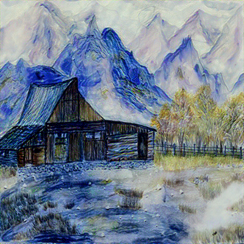

# 🎨 Neural Style Transfer using PyTorch

This project applies Neural Style Transfer (NST) to blend the **style of a famous painting** (like Van Gogh’s "Starry Night") with the **content of a personal artwork** (my own painting 🎨) using PyTorch.

## 🔍 Overview
NST uses a pre-trained VGG19 model to extract:
- **Content Features** from a given image.
- **Style Features** from a reference artwork.
The algorithm then updates a target image to match the content while mimicking the artistic style.

## 🖼️ Results

| Content Image | Style Image | Stylized Output |
|---------------|-------------|------------------|
|  |  |  |

## 🧠 Technologies
- Python
- PyTorch
- torchvision
- PIL
- Matplotlib

## 🚀 How to Run

```bash
# Install dependencies
pip install torch torchvision matplotlib pillow

# Run the script
python main.py
